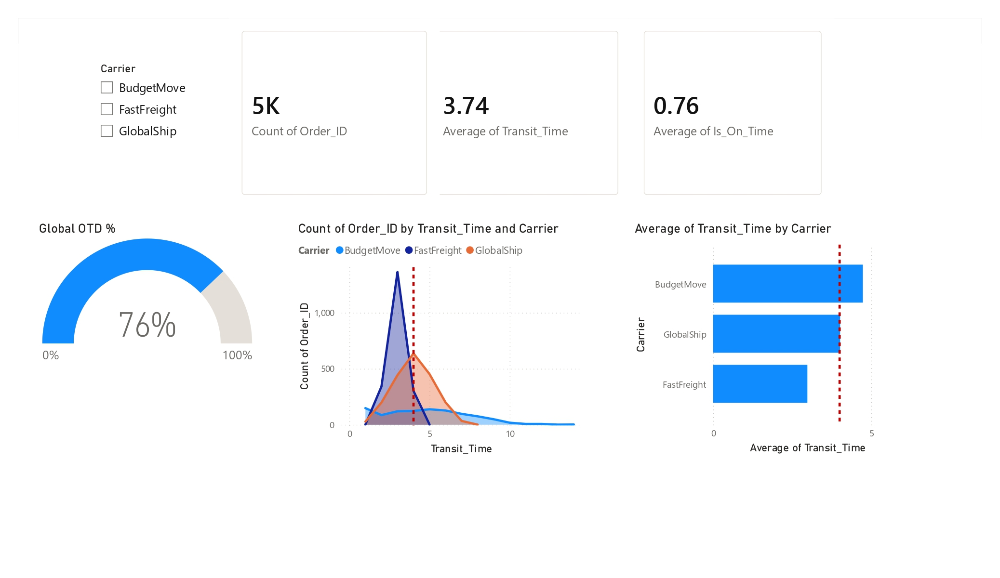

# Statistical Modeling of Supply Chain Reliability

A small Python project for simulating, processing, and visualizing logistics data to study supply chain reliability and variance.

## Overview

This project provides tools to:

- Generate synthetic logistics/supply chain data with configurable carrier profiles (speed vs. variance)
- Load that data into a local SQLite database and summarize on-time delivery performance by carrier
- Visualize transit-time distributions against a service-level agreement (SLA) target

## Contents

```
.
├── main.py                            # Interactive menu that runs the scripts below
├── requirements.txt                   # Python dependencies
├── logistics_raw_data.csv             # Example dataset generated by generate_logistics_data.py
├── logistics.db                       # SQLite database produced by sql_pipeline.py
├── power_bi_supply_chain_model.pbix   # Power BI dashboard built on the generated data
├── assets/
│   └── power_bi_supply_chain_model.jpg  # Screenshot of the Power BI dashboard
└── src/
    ├── generate_logistics_data.py     # Synthetic data generator
    ├── sql_pipeline.py                # Loads the CSV into SQLite and prints an OTD summary
    └── visual_variance.py             # Plots transit-time distributions by carrier
```

## Prerequisites

- Python 3.10+
- pip

## Setup

1. Clone the repository and navigate into it:

   ```bash
   git clone https://github.com/zynssam/Statistical-Modeling-of-Supply-Chain-Reliability.git
   cd Statistical-Modeling-of-Supply-Chain-Reliability
   ```

2. Create and activate a virtual environment:

   ```bash
   python -m venv .venv

   # Windows
   .venv\Scripts\activate

   # macOS / Linux
   source .venv/bin/activate
   ```

3. Install dependencies:

   ```bash
   pip install -r requirements.txt
   ```

## Usage

Run `main.py` for an interactive menu that lets you run any step in order:

```bash
python main.py
```

```
Menu:
1. Generate Data
2. Run SQL
3. Run Visuals
4. Exit
```

Each option can also be run directly as a standalone script:

### 1. Generate synthetic data

```bash
python src/generate_logistics_data.py
```

Creates 5,000 simulated orders across three carriers (`FastFreight`, `GlobalShip`, `BudgetMove`), each with a different average transit time and variance, and writes the result to `logistics_raw_data.csv` in the repository root.

### 2. Run the SQL pipeline

```bash
python src/sql_pipeline.py
```

Loads `logistics_raw_data.csv` into a local SQLite database (`logistics.db`, table `shipments`), then runs a query to compute total shipments, average transit time, and On-Time Delivery (OTD) percentage per carrier, printing an executive summary to the console.

### 3. Produce visualizations

```bash
python src/visual_variance.py
```

Opens a chart (via matplotlib) showing overlapping density plots of transit time by carrier, with a dashed line marking the 4-day SLA target — useful for comparing carrier speed against consistency at a glance.

## Data

`logistics_raw_data.csv` includes the following columns: `Order_ID`, `Order_Date`, `Carrier`, `SLA_Target_Days`, `Ship_Date`, and `Delivery_Date`. To use your own data, either regenerate the file with `generate_logistics_data.py` (adjust the carrier profiles or record count at the top of the script) or replace `logistics_raw_data.csv` directly, keeping the same column names, before running the SQL pipeline or visualizations.

## Power BI Dashboard

`power_bi_supply_chain_model.pbix` is a Power BI report built on top of the generated dataset, for exploring carrier reliability visually outside of Python. Open it with Power BI Desktop and point it at your own `logistics_raw_data.csv` or `logistics.db` to refresh it with new data.



📊 [Download the Power BI dashboard](power_bi_supply_chain_model.pbix)

## Notes

- `logistics.db` is a generated artifact — delete it and re-run the SQL pipeline at any time to rebuild it from the current CSV.
- The synthetic data generator uses a fixed random seed (`42`), so re-running it produces the same dataset unless you change the seed or parameters in `src/generate_logistics_data.py`.
